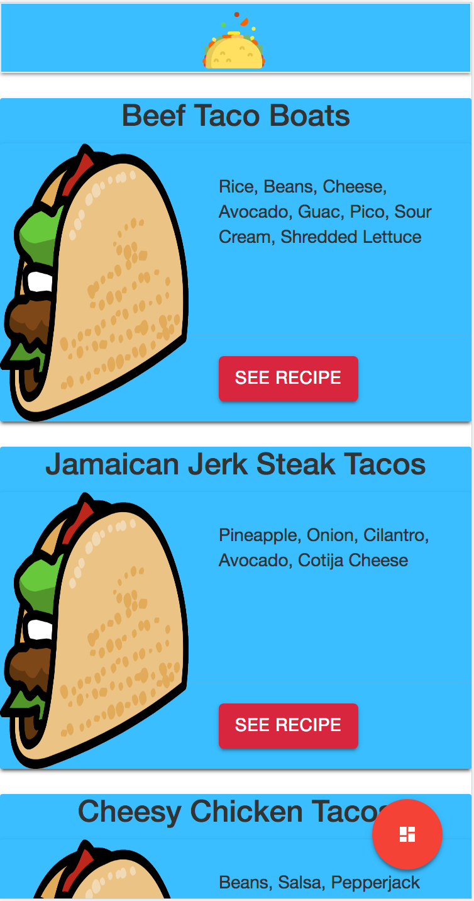
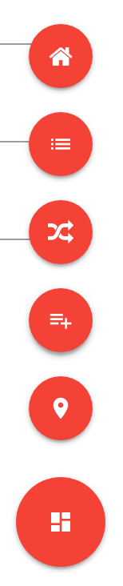

# TacoTuesday

## DEPLOYED TO
[](https://pwa-taco-tuesday.firebaseapp.com)
[](https://taco-tuesday.herokuapp.com)

## Screen Shots






## Technologies Used

1. Angular 2
2. Firebase DB
3. Angular CLI
4. Angular 2 Google Maps (AGM)
5. TypeScript
6. Materialize CSS
7. GOOGLE ON GOOGLE ON GOOGLE

For more on what Angular CLI and what you can do with it after creating a new Build (ng new project-name) check out below...

This project was generated with [angular-cli](https://github.com/angular/angular-cli) version 1.0.0-beta.28.3.

### Development server
Run `ng serve` for a dev server. Navigate to `http://localhost:4200/`. The app will automatically reload if you change any of the source files.

### Code scaffolding

Run `ng generate component component-name` to generate a new component. You can also use `ng generate directive/pipe/service/class/module`.

### Build

Run `ng build` to build the project. The build artifacts will be stored in the `dist/` directory. Use the `-prod` flag for a production build.

### Running unit tests

Run `ng test` to execute the unit tests via [Karma](https://karma-runner.github.io).

### Running end-to-end tests

Run `ng e2e` to execute the end-to-end tests via [Protractor](http://www.protractortest.org/).
Before running the tests make sure you are serving the app via `ng serve`.

### Deploying to GitHub Pages

Run `ng github-pages:deploy` to deploy to GitHub Pages.

### Further help

To get more help on the `angular-cli` use `ng help` or go check out the [Angular-CLI README](https://github.com/angular/angular-cli/blob/master/README.md).

## Approaches to the App
This app started out as a PWA React app that after many attempts to get working in state was scrapped. I decided to then move into Angular 2 as I really understood the Angular 2 component swap without state dependency. The Angular 2 team was working as well with PWA options and has a CLI interface that creates a PWA or a Mobile app with a few extra files (use the -PWA and -mobile tag in CLI with new project). However, this app is not a PWA.

Angular 2 is very similar to Angular 4 so there wont be much for me to do to move to 4 in the future or work to build PWA with Angular. They are also fully supporting Native Script which allows for you to build a Native app with Angular that is closer to the hardware of the phone. Native Script also is JavaScript so that you would not need to write in Xcode or Android Studio.

The app idea came from the Taco Tuesday hype all over social media and with a random taco api call that returns a random taco I thought why not? The idea is to expand futher to connect with social media that will show peoples posts on Twitter and Instagram using a particular hashtag to be defined later.

## Installation
There is not installation instructions with this app other than to go to the hosted web sites. But for Angular CLI here are some of the install guides as well as the cli commands..

Install globally
```command line
npm install -g @angular/cli
```

Generating a New Angular Project
```command line
ng new PROJECT-NAME
cd PROJECT-NAME
ng serve
```

Generating a New Angular Component. So you dont have to create a new folder with each file required. This also imports and injects in the proper files without you figuring out how to link every component you create together
```command line
ng generate component my-new-component
ng g component my-new-component # using the alias
# components support relative path generation
# if in the directory src/app/feature/ and you run
ng g component new-cmp
# your component will be generated in src/app/feature/new-cmp
# but if you were to run
ng g component ../newer-cmp
# your component will be generated in src/app/newer-cmp
# if in the directory src/app you can also run
ng g component feature/new-cmp
# and your component will be generated in src/app/feature/new-cmp
```

Serve a Product Version of your build
```command line
ng serve --prod
```

Build a Product Version for deployment
```command line
ng build --prod
```

Mobile New Angular Project
```command line
ng new hello-mobile --mobile
cd hello-mobile
ng serve
```

For more on the CLI and info about Angular 2 and Angular Mobile/PWA check out the following links
[Angular Mobile](https://github.com/angular/mobile-toolkit)
[Angular Mobile Site](https://mobile.angular.io/)
[Angular CLI](https://github.com/angular/angular-cli)

## Users
Any one and everyone who loves tacos. If they want to:
1. Find Tacos
2. Make Tacos
3. Share Tacos
4. Create Tacos

## Wireframes


## Problems, Unsolved, Major Hurdles
Angular 2 to connect with Firebase requires a npm package angularfire2 that just recently updated, which at this time does not have any active documented working examples, this inclued the angularfire2 gihub page that talks about the update

Angular 2 Google Maps does not have a way currently that shows how to get more info or directions from the markers on the map. Which makes this Goolge Maps API usless for what maps would be used for

User authentication with both Firebase and Auth0 do not have current updated versions for Angular 2 at the moment, but I believe that they are working to resolve the issues. I scrapped 3 builds due to authentication with both of them (firebase *2 and Auth0 *1).